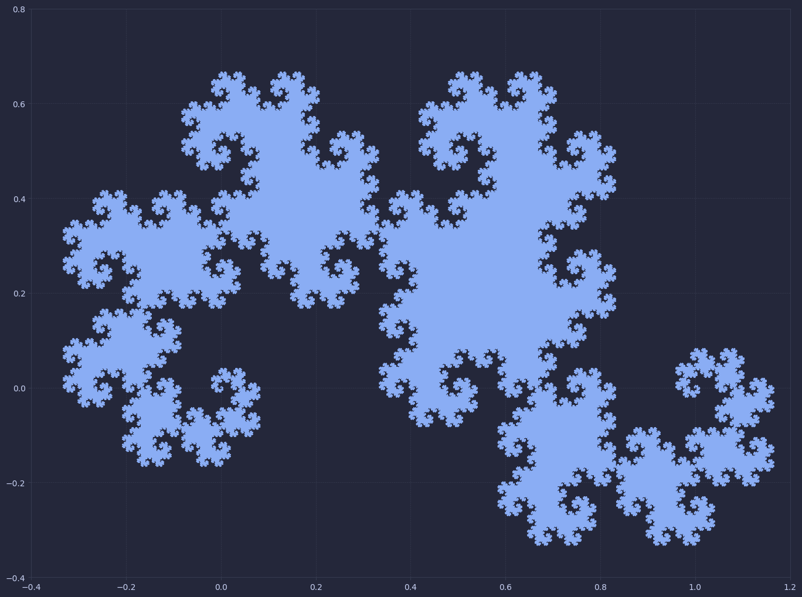

# Dragon Curve Fractal

The Dragon Curve, (also known as the Heighway dragon) is a fractal generated by the recursive "folding" of a line segment The limit of this process results in the iconic shape as seen below. Read more about the [Dragon Curve](https://en.wikipedia.org/wiki/Dragon_curve) on it's Wikipedia page.

## Construction

The fractal starts with a line segment. An iteration will take all line segments and extend them to pass through a point 90 degrees orthogonal to the original segment. These extensions are performed in an alternating fashion. An intuitive way of thinking about the fractal is folding a piece of paper as seen in the figure below.

## Progression of the fractal

